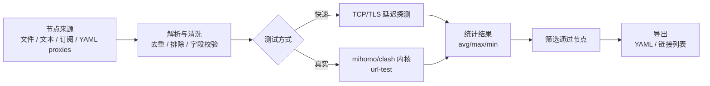
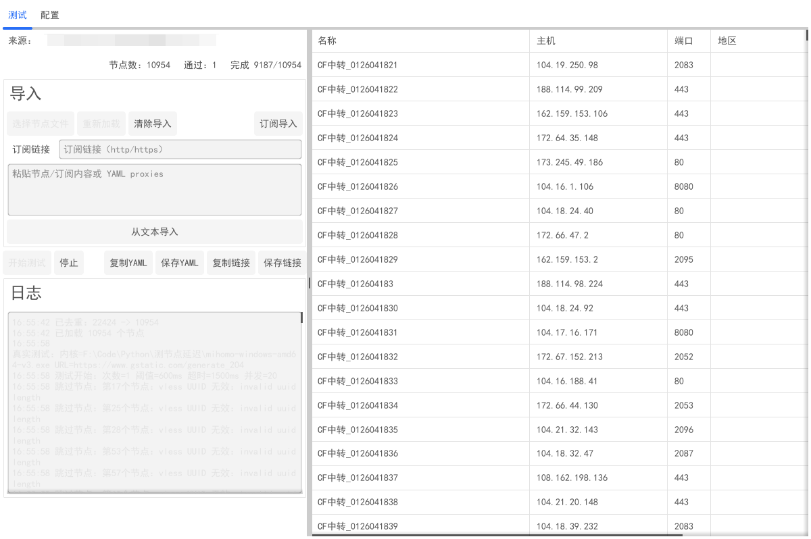
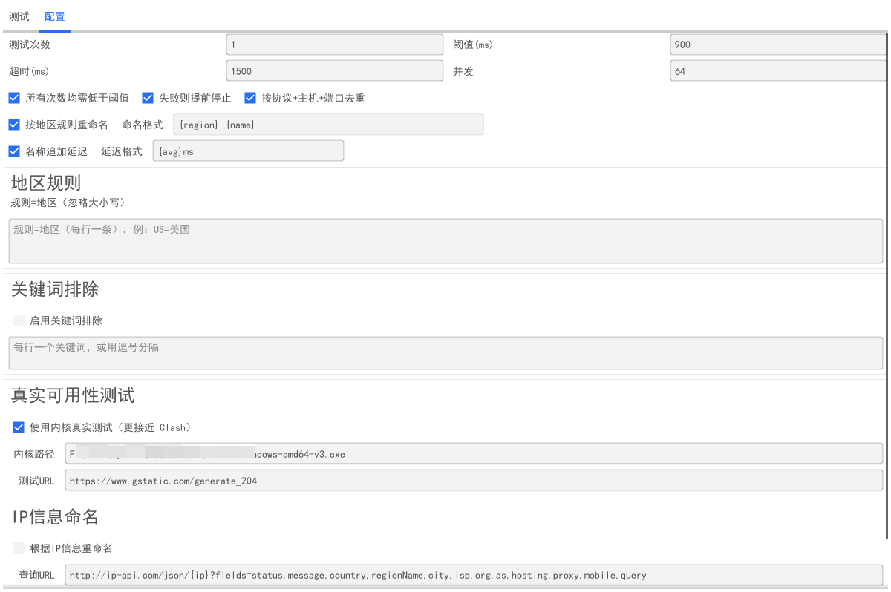

<!--
  TODO:
  - 将下方徽章里的 `popy/node-latency-gui` 替换为你的 GitHub 仓库：<OWNER>/<REPO>
  - 如果你有 Logo，请将图片放到 `src/logo.png`（或修改下方路径）
-->

<p align="center">
  
</p>

<h1 align="center">Node Latency GUI</h1>

<p align="center">
  Go 语言编写的节点批量延迟测试工具 · 订阅/文本/YAML 一键导入 · Clash/Mihomo 配置快速生成
</p>

<p align="center">
  
  
  
  <a href="https://github.com/popy/node-latency-gui/stargazers">
    
  </a>
</p>

<p align="center">
  <a href="#-快速开始">快速开始</a> ·
  <a href="#-使用指南">使用指南</a> ·
  <a href="#-贡献指南">贡献</a>
</p>

---

## 📑 目录

- [🌟 简介](#-简介)
- [✨ 特性](#-特性)
- [🛠 技术栈](#-技术栈)
- [🏗 架构图](#-架构图)
- [📸 截图](#-截图)
- [📁 目录结构](#-目录结构)
- [🚀 快速开始](#-快速开始)
- [📖 使用指南](#-使用指南)
- [🤝 贡献指南](#-贡献指南)
- [📄 许可证](#-许可证)
- [👤 作者](#-作者)

## 🌟 简介

Node Latency GUI 是一个面向日常“选节点/筛节点”场景的 GUI 工具：导入节点或订阅后，批量测试延迟与可用性，并将通过的节点一键导出为 Clash/Mihomo 的 `proxies` 配置或节点链接列表。

- 节点来源推荐：`https://if.bjedu.tech/`（可获取大量节点，复制到软件中直接测试）

## ✨ 特性

- [x] 多种导入方式：本地文件 / 文本粘贴 / 订阅链接（HTTP/HTTPS）
- [x] 多协议支持：VLESS / VMess / Trojan / Shadowsocks；支持从 Clash YAML 的 `proxies` 导入
- [x] 高效率测试：自定义次数、阈值、超时、并发；支持“失败则提前停止”
- [x] 节点清洗：按协议+主机+端口去重；关键词排除；参数与字段预校验（减少垃圾节点干扰）
- [x] 一键导出：生成 Clash/Mihomo YAML（保存/复制）或导出通过节点链接列表（保存/复制）
- [x] 可选增强：IP 信息查询并按模板重命名；使用 mihomo/clash 内核进行“真实测试”（更接近 Clash 行为）

## 🛠 技术栈

<p>
  
  
  
  
</p>

| 模块 | 说明 |
| --- | --- |
| UI | Fyne（跨平台 GUI） |
| 解析 | 支持订阅/文本/Clash YAML `proxies`，并进行必要的字段清洗与校验 |
| 测试 | TCP/TLS 延迟探测；可选 mihomo/clash 内核“真实测试” |
| 导出 | 生成 Clash/Mihomo YAML；导出通过节点链接列表 |

## 🏗 架构图



## 📸 截图

<table>
  <tr>
    <td width="50%"></td>
    <td width="50%"></td>
  </tr>
</table>

## 📁 目录结构

```text
.
├─ main.go
├─ go.mod
├─ go.sum
├─ demo.yaml
├─ nodes.yaml
├─ 节点.txt
├─ node-latency-gui.exe
├─ mihomo-windows-amd64-v3.exe
└─ src
   ├─ 运行截图.png
   └─ 配置截图.png
```

## 🚀 快速开始

### 环境要求

- Go 1.24+（与 `go.mod` 保持一致）
- Windows 10/11（推荐）；macOS / Linux 亦可

### 方式一：直接运行（Windows 预构建）

```powershell
.\node-latency-gui.exe
```

### 方式二：从源码运行

```powershell
go run .
```

### 方式三：构建可执行文件

```powershell
go build -o node-latency-gui.exe .
```

> Windows 想隐藏控制台窗口可尝试：

```powershell
go build -ldflags "-H=windowsgui" -o node-latency-gui.exe .
```

### 可选：启用内核真实测试（更接近 Clash）

1. 准备内核（mihomo/clash），例如将 `mihomo-windows-amd64-v3.exe` 放到程序同目录
2. 打开软件，在设置里勾选「使用内核真实测试（更接近 Clash）」
3. 内核路径可留空（会尝试自动查找），或手动选择/填写

## 📖 使用指南

### 1) 获取节点

- 从网站获取并复制：`https://if.bjedu.tech/`
- 或者准备你已有的：
  - 节点链接（每行一个）
  - 订阅内容（支持 Base64 订阅）
  - Clash/Mihomo 配置（包含 `proxies:`）

### 2) 导入

在主界面选择任意一种方式：

- 「选择节点文件」：导入 `.txt/.yaml/.yml` 等
- 「从文本导入」：粘贴节点/订阅内容或 YAML `proxies`
- 「订阅导入」：填写订阅链接并一键拉取

### 3) 配置推荐（从“好用”开始）

- 测试次数：`3`
- 阈值(ms)：`300`
- 超时(ms)：`2000`
- 并发：`128`（视网络与机器性能调整）
- 勾选：
  - 「按协议+主机+端口去重」
  - 「失败则提前停止」
  - 「名称追加延迟」

### 4) 节点命名（可选）

#### 地区规则重命名

- 规则格式：每行一条 `规则=地区`，例：`US=美国`
- 命名格式支持占位符：
  - `{region}` `{name}` `{host}` `{scheme}` `{index}`

#### 按 IP 信息重命名

可配置 IP 查询 URL 与命名模板，模板占位符：

- `{country}` `{region}` `{city}` `{isp}` `{org}` `{asn}` `{ip}` `{residential}`

### 5) 开始测试与导出

- 点击「开始测试」，完成后可：
  - 「保存YAML」/「复制YAML」：生成 `nodes.yaml`（基于 `demo.yaml` 模板，或自动使用内置最小模板）
  - 「保存链接」/「复制链接」：导出通过节点链接列表（便于回填到订阅/客户端）

## 🤝 贡献指南

欢迎 PR / Issue！

```bash
# 1) Fork 后创建分支
git checkout -b feat/your-feature

# 2) 开发

# 3) 自测
go test ./...

# 4) 提交并推送
git commit -am "feat: your feature"
git push origin feat/your-feature
```

## 📄 许可证

本项目许可证：TBD（建议补充 `LICENSE` 文件后再发布）。

## 👤 作者

- popy

